# Wi-Fi Authentication with Okta RADIUS and EAP-TTLS for Unifi

<aside>
➡️

I spent a lot of time trying to manually connect to the WiFi by importing the CA directly into my Mac's system keychain, but I was never able to successfully connect. The only method I found that works is to create a 802.1x configuration profile and deploy it through an MDM.

</aside>

## **Introduction**

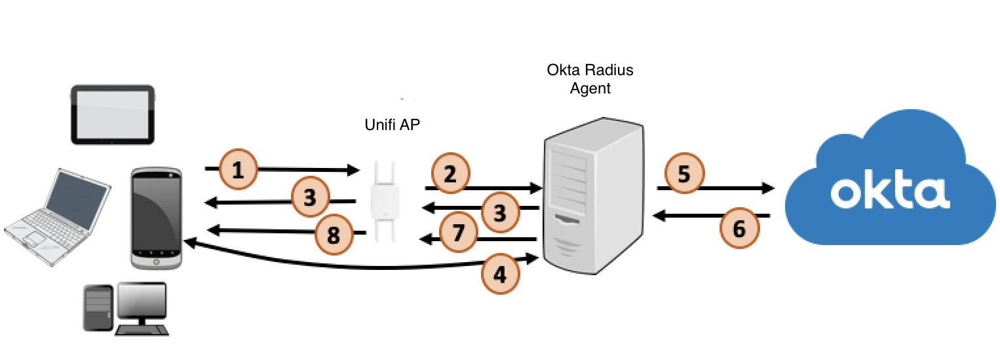

The data flow has the following steps:

1. A supplicant (mobile device/laptop/desktop) tries to associate with the Unifi Access Point (AP).
2. The Unifi AP contacts the Okta RADIUS agent with the user's identity
3. The Okta RADIUS agent requests the start of the EAP-TTLS conversation, which is forwarded to the supplicant
4. A TLS channel is established between the supplicant and the Okta RADIUS agent. Within the tunnel, the supplicant sends the configured username and password to the Okta RADIUS agent.
5. The Okta RADIUS agent sends authentication information to the Okta tenant.
6. The Okta tenant sends the authentication response back to the Okta RADIUS agent.
7. The Okta RADIUS agent sends an Accept or Reject message to the Unifi AP.
8. The Unifi AP accepts or rejects the terminal access request.

### **Prerequisites**

Before starting, ensure you have the following:

- **Hardware**:
    - **Unifi** access points for managing the Wi-Fi network.
    - **macOS** devices for testing the secure Wi-Fi connection.
    - **VM** for installing the **Okta RADIUS Agent** (on-premises or AWS).
- **Software**:
    - **Okta** for user management and authentication.
    - **Okta RADIUS Agent** to handle RADIUS authentication requests.
    - **Unifi Controller** to configure the RADIUS server and Wi-Fi profile.
    - **Jamf Pro** to deploy certificates and configuration profiles on macOS devices.
    - **OpenSSL** to create the internal CA and certificates.

### **Global Workflow Overview**

Here is an overview of the overall process, from certificate generation to a client’s secure connection to the Wi-Fi network:

1. **Creation of the internal CA**: Generate our own certificate authority to sign certificates.
2. **Generate certificates for the RADIUS server**: Create a server certificate signed by the internal CA.
3. **Installation of the Okta RADIUS Agent**: Set up the Okta RADIUS agent to handle authentication requests.
4. **Add the Okta application for Wi-Fi authentication**: Configure Okta to manage users and facilitate authentication on the Wi-Fi network.
5. **Configure Unifi access points**: Set up the access points to use RADIUS authentication.
6. **Deploy certificates via Jamf Pro**: Automatically distribute certificates and configuration profiles to macOS devices.
7. **Test with a macOS client**: Verify the connection to the Wi-Fi network using Okta RADIUS authentication and EAP-TTLS.

## **1. Generation of the Internal CA**

- **Creation of the Certificate Authority (CA)**

We will use OpenSSL to generate the Internal CA. A Mac or Linux machine can be used.

Generate the private key for the CA:

```bash
openssl genrsa -out ca.key 4096
```

Create a self-signed certificate for the CA (valid for 10 years, for example):

```bash
openssl req -x509 -new -nodes -key ca.key -sha256 -days 3650 -out ca.cer -subj "/C=FR/ST=Ile-de-France/L=Paris/O=BENJIT/CN=BENJITCA"
```

## 2. **Creating the Certificate for the RADIUS Server**

Generate the private key for the RADIUS server:

```bash
openssl genrsa -out radius.key 4096
```

Create a Certificate Signing Request (CSR) for the RADIUS server:

```bash
openssl req -new -key radius.key -out radius.csr -subj "/C=FR/ST=Ile-de-France/L=PARIS/O=BENJIT/CN=okta.radius"
```

Sign the CSR with your CA to generate the certificate for the RADIUS server:

```bash
openssl x509 -req -in radius.csr -CA ca.cer -CAkey ca.key -CAcreateserial -out radius.cer -days 3650 -sha256
```

Merge `radius.cer` and `radius.key`:

```bash
openssl pkcs12 -export -out radius.pfx -inkey radius.key -in radius.cer
```

Enter a password for the export and remember it for later.

You need to set aside **radius.pfx** and **ca.cer** for the next steps.
**ca.cer** will be deployed to all Macs that need to connect to the Wi-Fi using the Okta RADIUS agent. It will validate the RADIUS server's certificate during the Wi-Fi connection.
**radius.pfx** is signed by the CA and will be automatically accepted by all Macs that have the CA installed and trusted.

## **3. Installation of the Okta RADIUS Agent**

- **Prerequisites for the Okta RADIUS Agent**
    
    Install on a VM (Ubuntu recommended).
    
    An admin account on Okta.
    
- **Installation and Configuration of the Okta RADIUS Agent**
    
    Download the **Okta RADIUS Server Agent** from the Okta admin interface.
    


Copy and paste the download link, then run this command from the Ubuntu VM:

```bash
wget https://benjit-admin.okta.com/static/radius/OktaRadiusAgentSetup-2.22.0.deb
```

Run the installation of the Okta RADIUS agent and follow the instructions.

Enter your Okta organization URL when prompted:

[https://benjit.okta.com](https://benjit.okta.com/)

Do not select a proxy.

```bash
sudo dpkg -i OktaRadiusAgentSetup-2.22.0.deb
(Reading database ... 98316 files and directories currently installed.)
Preparing to unpack OktaRadiusAgentSetup-2.22.0.deb ...
INFO: Group 'OktaRadiusService' already exists
INFO: User 'OktaRadiusService' already exists
INFO: User 'OktaRadiusService' already part of Group 'OktaRadiusService'
Unpacking ragent (2.22.0) over (2.22.0) ...
Setting up ragent (2.22.0) ...

========================================================================

    Welcome to the Okta RADIUS Agent configuration script. 
    This needs to be run once to populate required application settings.

========================================================================

Enter the base URL for your Okta organization (e.g. https://acme.okta.com): 

```

Visit the provided URL and log in with your Okta Admin account, for example:

Please visit the URL: [https://benjit.okta.com/oauth2/auth?code=o59hnre1](https://benjit.okta.com/oauth2/auth?code=o59hnre1) before Fri Oct 11 15:35:10 CEST 2024 to authenticate and continue agent registration.

Grant access when prompted.

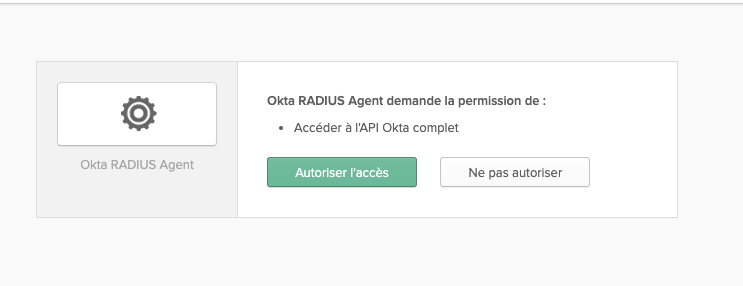

Return to the Okta Dashboard, then go to Agents. You should see that the agent is operational.

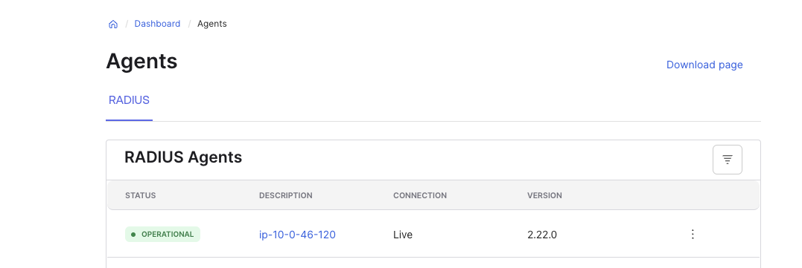

## **4. Adding the Okta Application for Wi-Fi Authentication**

- **Integrating the Okta Application for Authentication Control**
    
    Add the Cisco Meraki application (there is no application for Unifi, but the Cisco application works with Unifi as well).
    
    Browse the App Catalog.
    

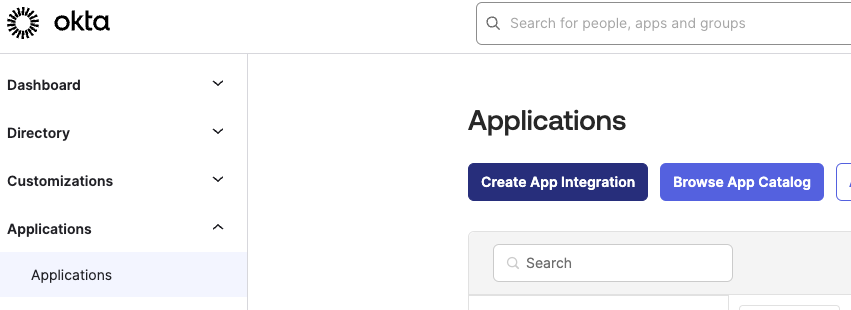

Search for **Cisco Meraki Wireless LAN (RADIUS)**.

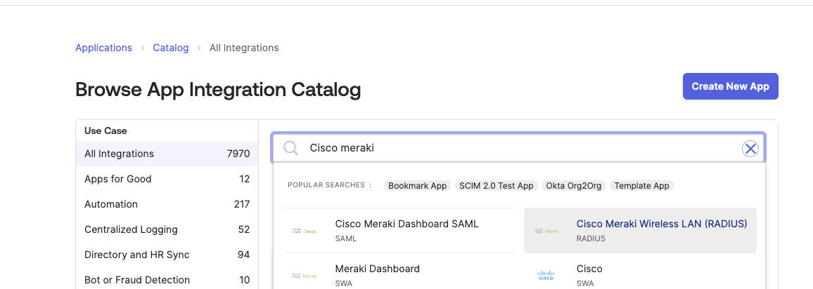

Add Integration

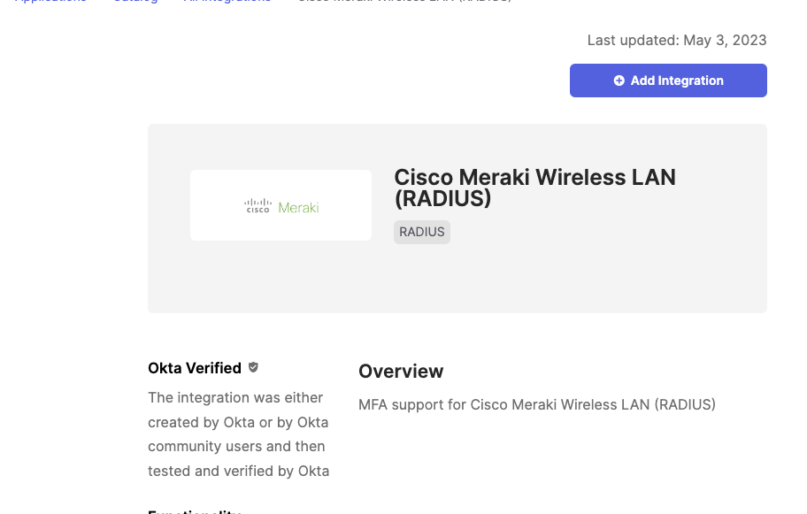

You can change the name and set it to **Unifi (RADIUS)**; it doesn’t matter.

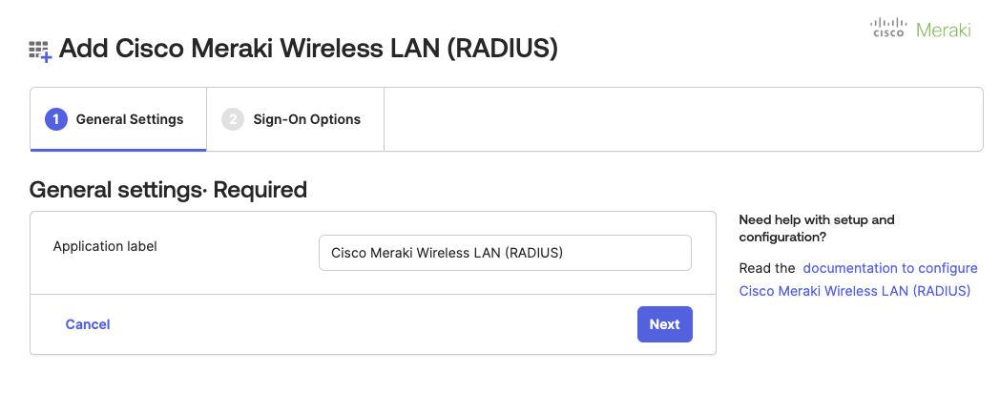

Enter port **1812**, create a **secret key**, and write it down somewhere.

Do not modify anything else, and click **Done**.

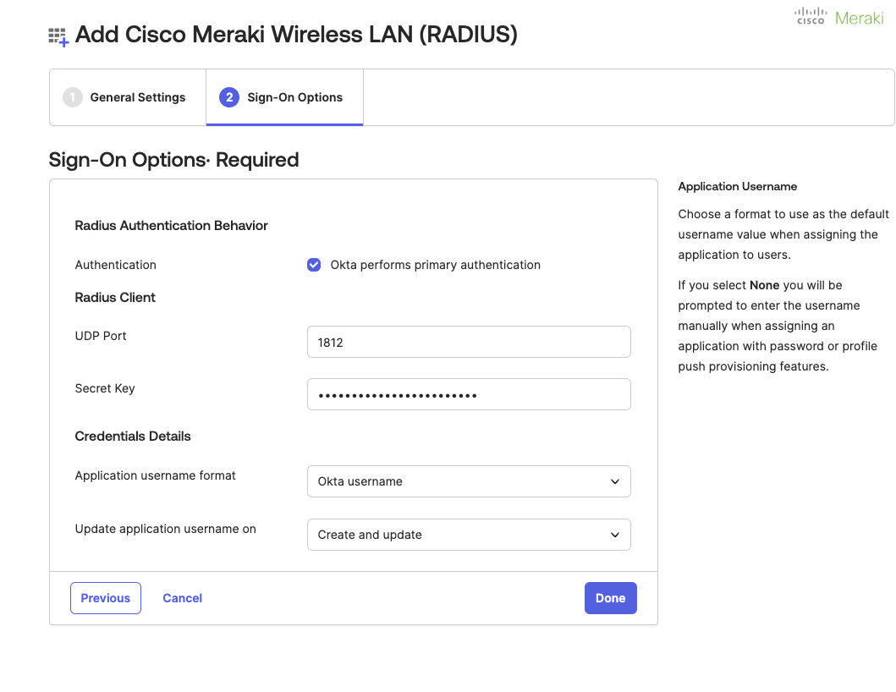

Go back to the **Sign-On** tab.

For **Authentication Protocol**, upload the previously created certificate **radius.pfx** (it contains the RADIUS certificate and its private key).

Enter the password used when exporting the certificates in **radius.pfx**.
Check the same settings as shown in the images to complete the configuration.

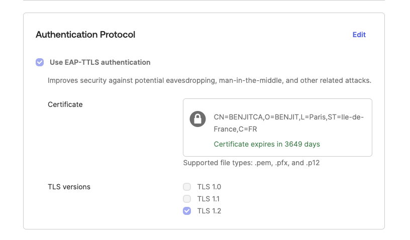

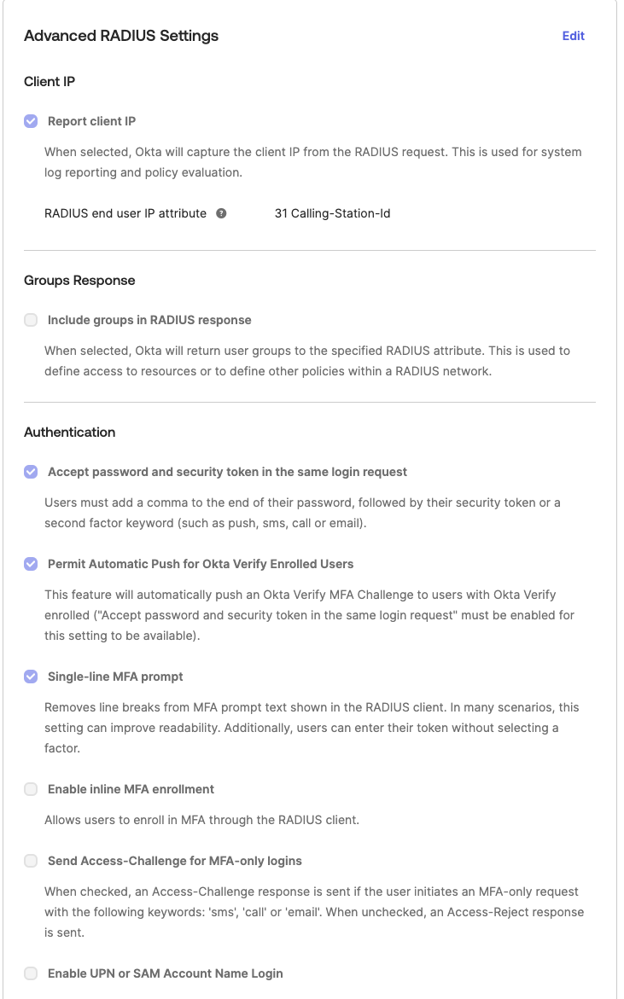

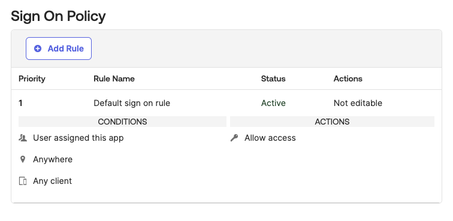

## **5. Configuration of Unifi Access Points**

- **Configuring the RADIUS Server in Unifi**

Go to the Unifi interface, then navigate to **Settings > Profiles > Radius**.

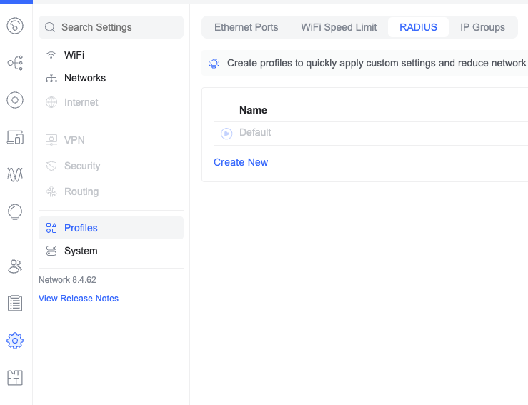

Create New

Enter a name “**Okta RADIUS**”

Enter the public IP (or internal IP if on-premises) of the Ubuntu server where the Okta RADIUS agent is installed

Set the port to **1812**

Enter the **secret key** you saved earlier.


Apply Changes

- **Creating the Wi-Fi network:**

Be sure to select the previously created **RADIUS Profile**.
Check the same settings as shown in the images to complete the configuration. 

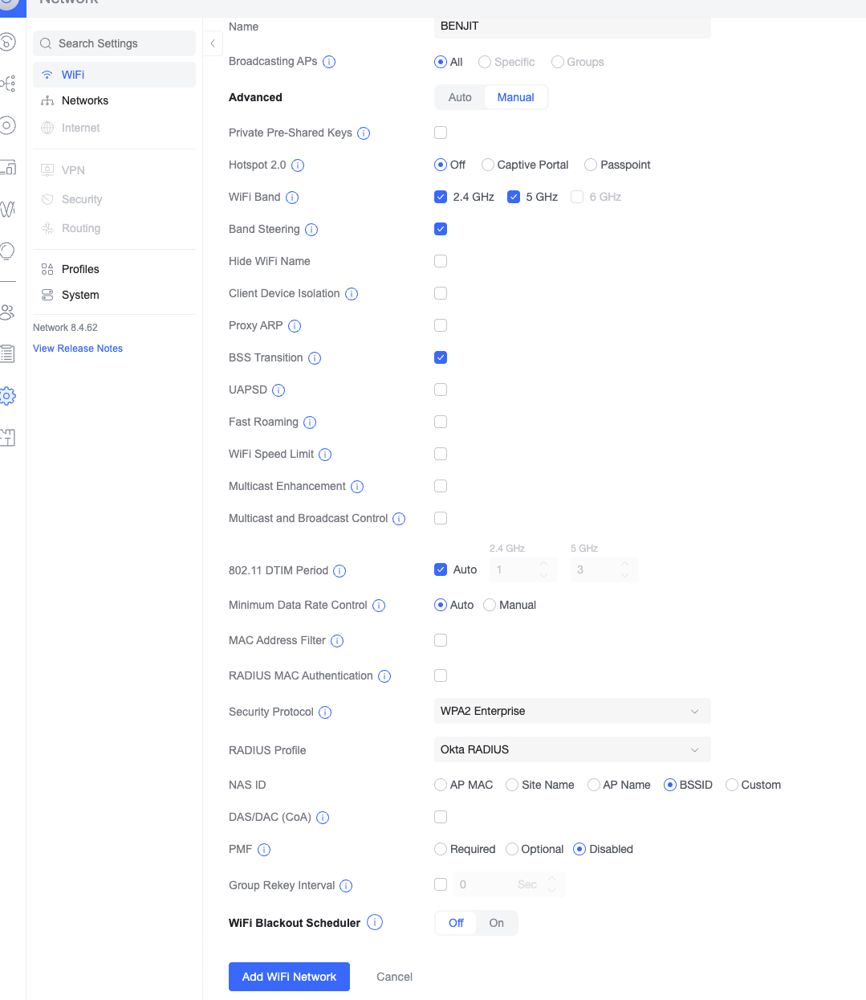

## **6. Deploying the Certificate via MDM Jamf**

- **Creating the 802.1X Profile and Deploying the CA with Jamf Pro**

In Jamf Pro, create a new configuration profile.
Check the same settings as shown in the images to complete the configuration. 


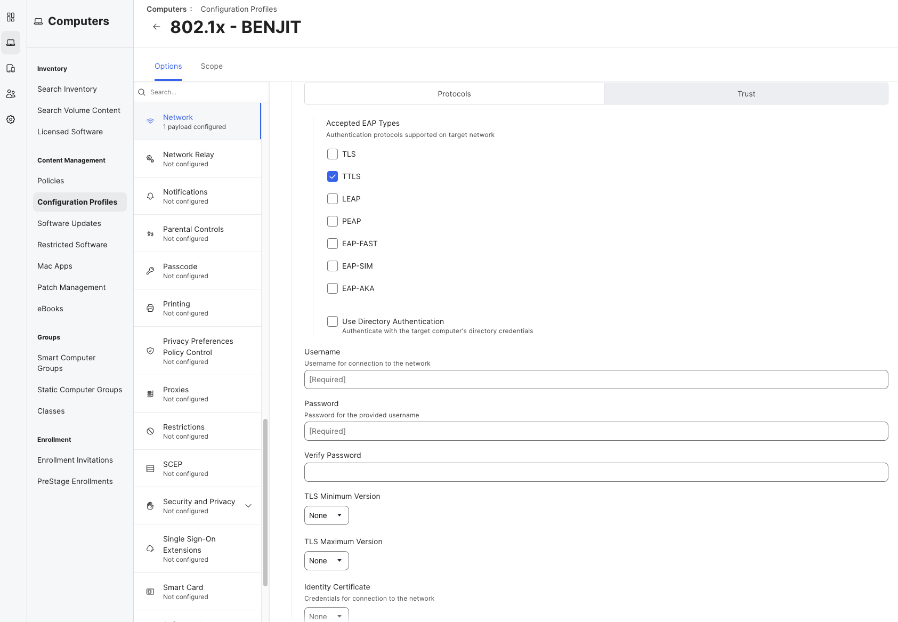


Now go to the **Certificates** section.

Click on **Configure**.

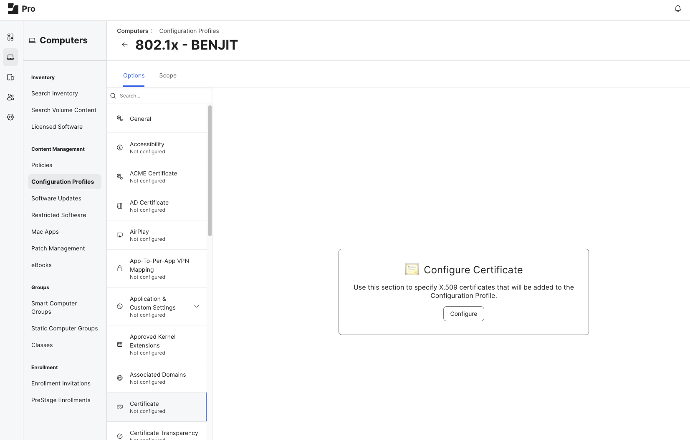

Enter the desired display name.

Upload the **ca.cer** certificate saved earlier

Save

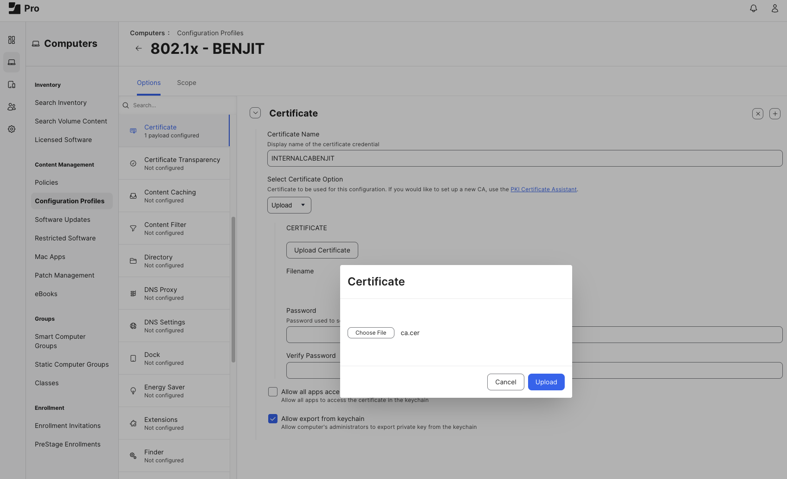

Go back to the **Networks** section.

Click on **Trust** and check the **INTERNALCABENJIT** certificate as trusted.

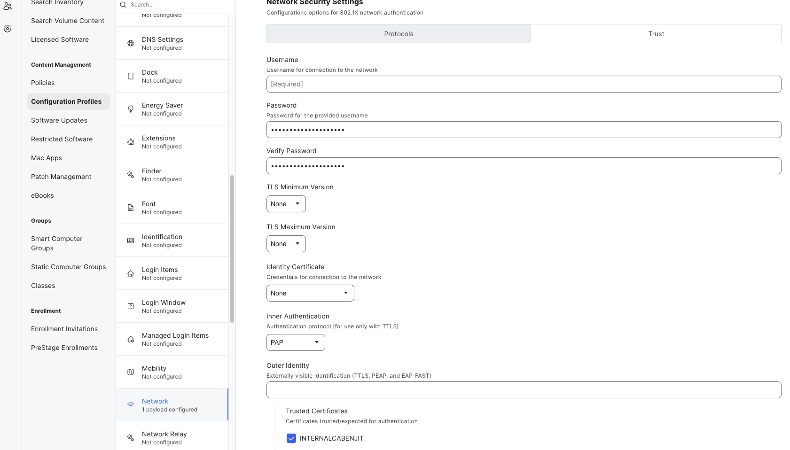

In **Scope**, select the Macs on which you want to deploy this profile.

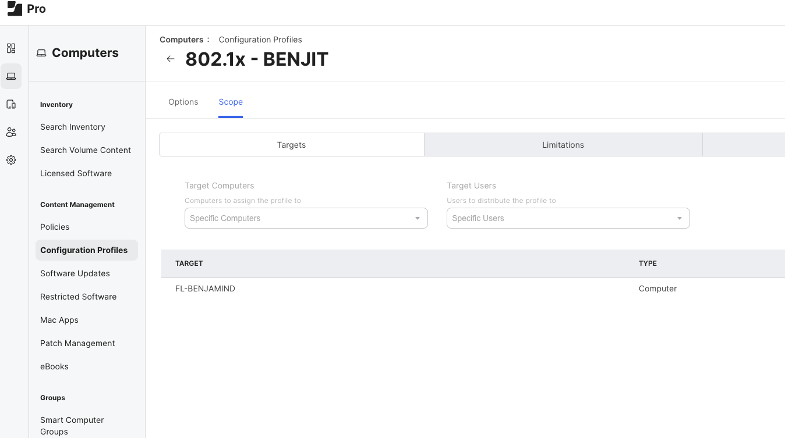

## **7. Testing with a Mac Client**

- **Connecting to the Wi-Fi Network**

If the configuration profile is correctly deployed, the Wi-Fi network **BENJIT** should appear on the Mac under known networks, and you should be able to connect using your Okta credentials.

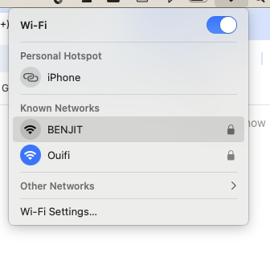


## **8. Troubleshooting**

To check the 802.1x connection logs on macOS:

```bash
 log show --predicate 'subsystem == "com.apple.eapol"' --last 1h
```

To check the logs on the RADIUS server:

```bash
sudo tail -f /opt/okta/ragent/logs/okta_radius.log | grep radius
```

Uninstall the Okta RADIUS agent:

```bash
sudo apt-get --purge autoremove ragent
```

Restart the Okta RADIUS agent:

```bash
sudo service ragent restart
```
